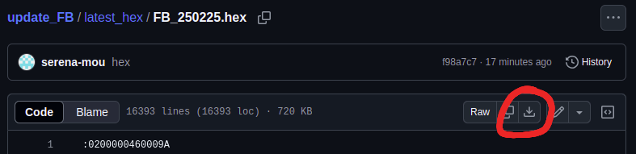
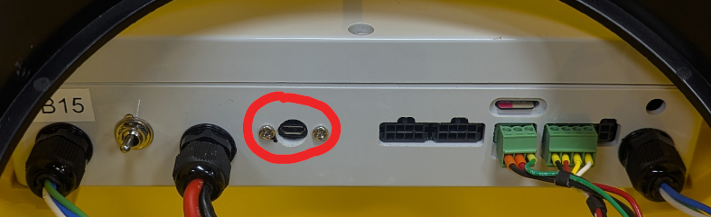

# update_FB
Update FloatyBoat (FB) firmware from a Windows machine

You will need:

    1. FloatyBoat yellow pod
    2. Windows computer
    3. Micro-USB cable

## Download TyTools

Click link to download tytools_0.9.9 for Windows

https://github.com/Koromix/tytools/releases/download/v0.9.9/tytools_0.9.9_win64.zip

Extract folder, open and double-click TyUploader

## Download the latest FB.hex file

Go to the [latest_hex](latest_hex) folder 

Click the FB_xxxxxx.hex file 

Click the Download raw file button on the top right

## Set up FloatyBoat

Plug in battery and turn on FloatyBoat

Plug micro-USB cable from computer to micro-USB port on the grey box inside the FB

## Flash Firmware

Once the FB is turned on and micro-USB cable is plugged into the computer, the TyUploader Application will auto-detect the USB Serial

Click "Upload" and select the latest FB.hex file you downloaded

You should hear the FB stop and start

ALL DONE!  